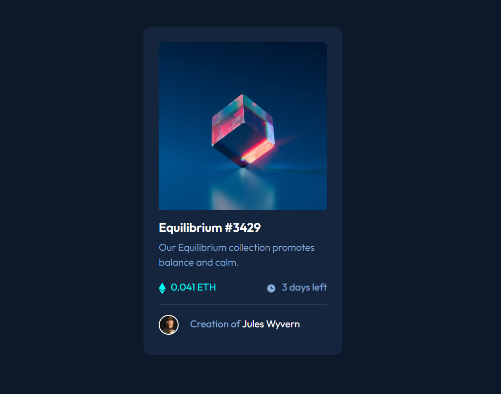

# Frontend Mentor - NFT preview card component solution

This is a solution to the [NFT preview card component challenge on Frontend Mentor](https://www.frontendmentor.io/challenges/nft-preview-card-component-SbdUL_w0U). Frontend Mentor challenges help you improve your coding skills by building realistic projects. 

## Table of contents

- [Overview](#overview)
  - [The challenge](#the-challenge)
  - [Screenshot](#screenshot)
  - [Links](#links)
  - [Built with](#built-with)
  - [What I learned](#what-i-learned)
  - [Useful resources](#useful-resources)
- [Author](#author)

## Overview

The challenge requires you to build a responsive card component that displays the information about an NFT (Non-Fungible Token). The NFT preview card component should have interactive elements such as hover states and should be optimized for various screen sizes. I have built it using Bootstrap 5 along with HTML and CSS.

### The challenge

Users should be able to:

- View the optimal layout depending on their device's screen size
- See hover states for interactive elements

### Screenshot

### Links

- Solution URL:https://scurlly.github.io/NFT-preview-card-component/

### Built with

- Semantic HTML5 markup
- CSS custom properties
- Bootstrap 5
- Flexbox
- CSS Grid
- Mobile-first workflow

### What I learned

The biggest challenge I faced during this project was creating the hover states for the interactive elements. It took some experimentation with CSS and JavaScript to get the desired effect, but I eventually figured it out.

One major learning from this project was the importance of using semantic HTML and CSS custom properties to maintain code organization and make it easier to update the design in the future.

### Useful resources

- [Hover on Image](https://www.w3schools.com/howto/howto_css_image_overlay.asp) - This helped me to get the hover effect on the image. 

## Author

- Frontend Mentor - [@scurlly](https://www.frontendmentor.io/profile/scurlly)

